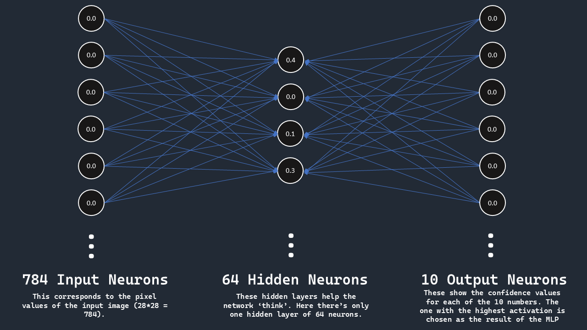

# Handwritten Character Recognition
#### This is a Flavortown project that shows how MLPS identify handwritten digits

<p align=center></p>

## Usage
- Run the compiled version from the release
### OR
- Clone the repo
- Add the MNIST images into the working directory as PNGs from this repo: https://github.com/rasbt/mnist-pngs/tree/main and rename the folders inside from 1,2,3... to one, two, three,...
- Run Train to create the training file
- Run Main. (Make sure both have the same working directory)
- To add your own training samples, draw them in the same style in a 28x28 png and save it to the corresponding folder inside src/training

## How it works
- This uses trained MLPs to identify which number you have drawn.
- MLPs are made with my custom AI library, **Cyton AI**
- They are trained first with the MNIST dataset - a collection of 60,000 handwritten digits.

### MLPs
MLPs (Multilayer Perceptron) contain several layers, each layer has many neurons.  
Neurons are just things that do computation. Every neuron in a layer in connected to every neuron in the next layer.  
These connections are called weights. When computing a neuron, the activations of all the previous neurons are multiplied with the corresponding weight and added up.  
By changing the weights of the network precisely, we can 'train' the network.

If you want a better explanation than this, here are some good resources for you:  
- #### [3b1b's course about MLPs and Neural Networks](https://www.youtube.com/watch?v=aircAruvnKk&list=PLZHQObOWTQDNU6R1_67000Dx_ZCJB-3pi)
- [IBM's explanation of MLPs](https://www.youtube.com/watch?v=7YaqzpitBXw)  
- [Sebastion Lague's video about neural network doodle-detection](https://www.youtube.com/watch?v=hfMk-kjRv4c)

In this project, the network has a structure of {28*28, 64, 10}.  
This means that there is 
- an input layer of 28*28=784 neurons (one for each pixel),
- one hidden layer of 64 neurons,
- and an output layer of 10 neurons (one for each number)

The pixel values of the image you draw is converted into a long array of numbers. This is given as the input to each input layer of the network.  
The network does its computation and the output neurons give their outputs.  
Each output neuron corresponds to each of the digits.  
The output neuron with the highest activation is chosen as the digit recognised.

<p align="center">

</p>

## Project Structure
```
character-recognition
├── 📂 src                          # Main code stuff
│   ├── 📂 ai                       # Cyton AI folder
│   ├── 📂 META-INF                 # build configuration bs
│   ├── ☕ Backend                  # Backend/MLP class
│   ├── ☕ Main                     # Main app
│   ├── ☕ PixelCanvas              # Drawing Canvas module
│   ├── ☕ Train                    # Training
│   └── 🖼️ mlp.png                  # png for readme
│
├── 📂 training                     # contains folders one-nine in which there are 28x28 images of that number.
│
├── 📃 weights.txt                  # all the weights of the network (made by training)
│
├── 📂 releases
│   ├── 🖼️ banner.png               # flavortown project banner
│   ├── 🎦 instructions.pptx        # instructions ppt
│   ├── 🎦 visuals.pptx             # powerpoint is peak graphic design
│   └── 🤐 SHIP.zip                 # first release
│
├── 📃 README.md                    # this
│
├── 📃 LICENSE                      # MIT licence
```